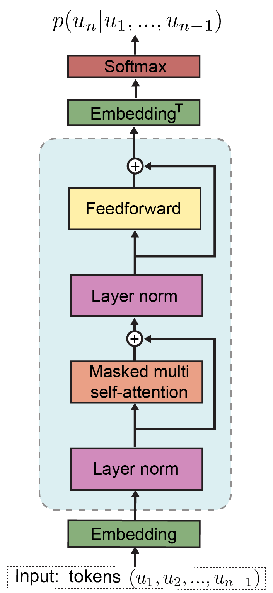

# Fine-tuing gpt2 for classification task

- GPT-2 is a transformers model pretrained on a very large corpus of English data in a 
  self-supervised fashion. This means it was pretrained on the raw texts only, with no humans labelling them in any way (which is why it can use lots of publicly available data) with an automatic process to generate inputs and labels from those texts. More precisely, it was trained to guess the next word in sentences.

 

 # Dataset 
 - can download from https://huggingface.co/datasets/GerindT/mini_amazon_sentimental/tree/main